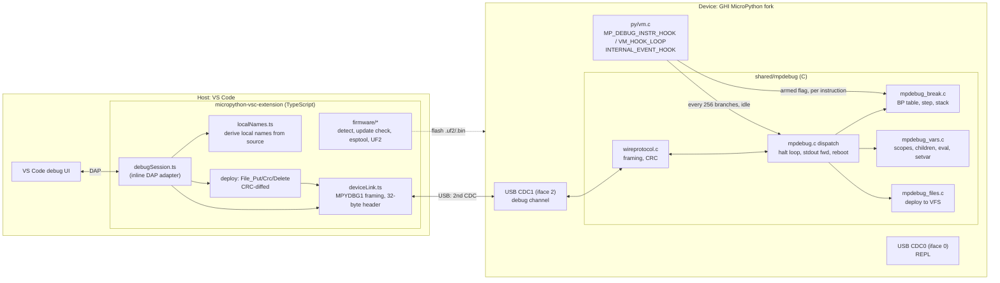
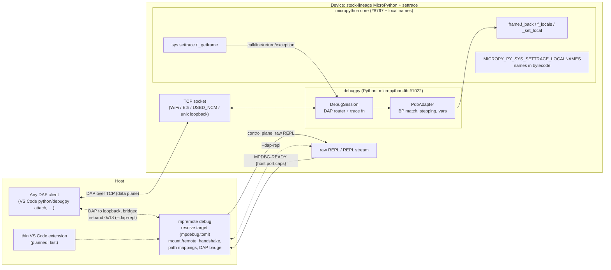
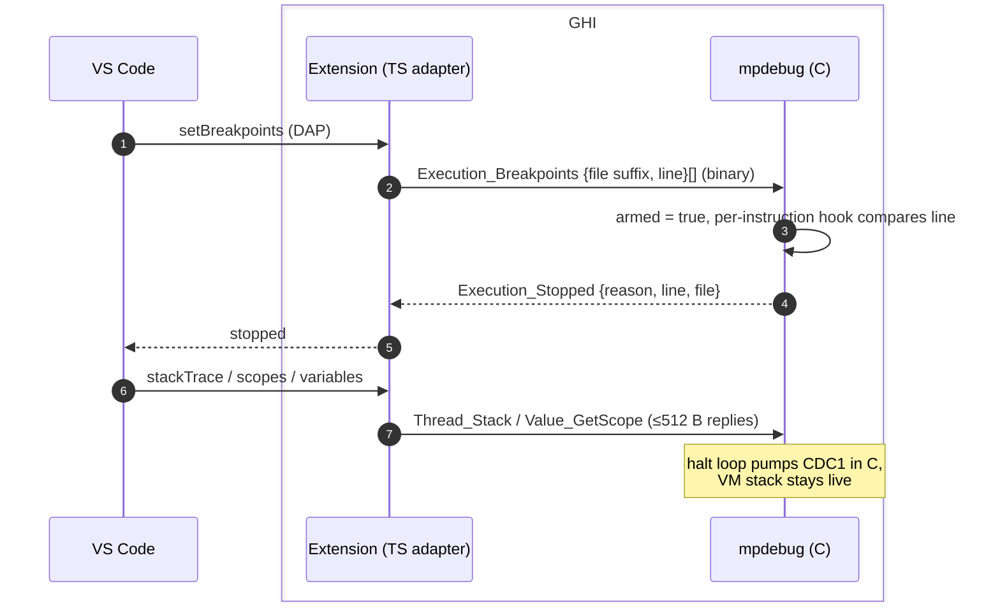
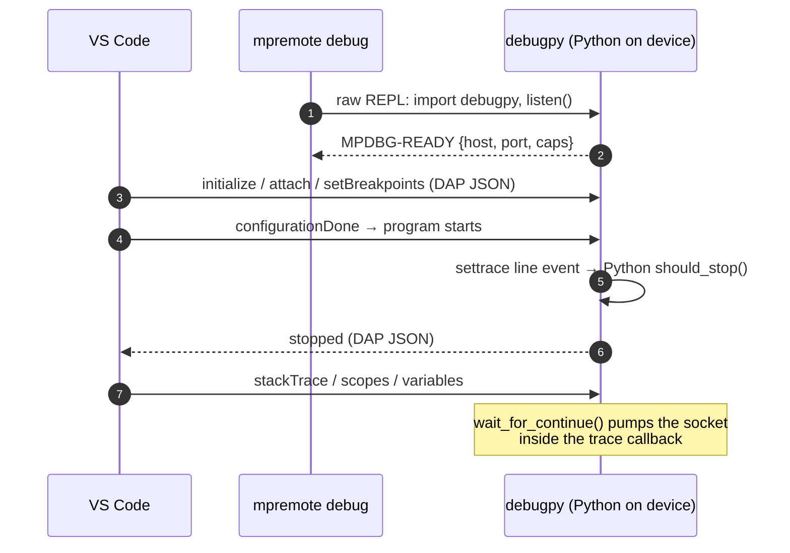

# GHI Electronics MicroPython debugger vs mpy-debugpy — comparative analysis

- Date: 2026-09-23
- Top repo HEAD: `1eaf939`; `micropython` @ `ea87c3501f`; `micropython-lib` @ `f584db6`
- Compared against: `ghi-electronics/micropython-firmware-debugger` @ `dev` `62449e5a0c`
  (fork of MicroPython v1.29.0), `ghi-electronics/micropython-vsc-extension` @ `main` `70b6a963`
- Sources read: GHI READMEs, `shared/mpdebug/{mpdebug.c,mpdebug.h,mpdebug_break.c}`,
  extension `src/{protocol.ts,localNames.ts}`; ours: `docs/debugging.md`,
  `planning/BACKGROUND.md`, `planning/ROADMAP.md` Status.
  Statements marked [INFERENCE] are drawn from file names or README claims, not code I read.

## TL;DR

The two projects put the debugger in different places.

- **GHI**: a **C debug engine in firmware** (`shared/mpdebug/`, about 100 kB of C), a custom
  binary wire protocol derived from the .NET Micro Framework debugger, carried on a
  **second USB CDC interface**. A **TypeScript DAP adapter in the VS Code extension** turns
  DAP into that protocol. Deploy (CRC diff), firmware install/update and the REPL console
  are all part of the extension. The result is a finished product for a fixed set of
  boards (RP2040, RP2350, ESP32-S2/S3), shipped with prebuilt firmware.
- **Ours**: a **Python DAP server running on the device** (`debugpy`, micropython-lib
  #1022), built on **generic interpreter primitives** (`sys.settrace`, `_getframe`,
  `f_back`, `f_locals`, local names, `_set_local`: #8767 lineage). Its transport is TCP
  (unix, network, USB-NCM) or DAP framed in-band on the REPL stream (`--dap-repl`).
  **`mpremote debug`** handles orchestration, and the `MPDBG-READY` handshake reports
  capabilities probed at runtime. The VS Code piece is deliberately thin and comes last.
  Everything is aimed at upstream.

GHI traded upstreamability and transport generality for performance, polish and a
zero-config first run. We traded raw performance and out-of-the-box UX for a design
upstream can merge, any board, and any DAP client.

## Architecture

### GHI

### Ours

### A breakpoint hit, side by side

## Dimension-by-dimension

| Dimension | GHI | Ours | Assessment |
|---|---|---|---|
| **Where DAP terminates** | Host, in the extension (TS). The device speaks a compact binary RPC. | Device, in debugpy (Python). The device speaks DAP JSON. | GHI's split suits constrained devices. Ours has no host adapter to write, and any DAP client can attach. |
| **VM hook** | Custom `MP_DEBUG_INSTR_HOOK(cs)` in the VM loop, a single `mp_debug_armed` flag test when idle. `MICROPY_PY_SYS_SETTRACE` is enabled "for its metadata and hook site only; the Python trace callback is never used" (`mpdebug_break.c`). | `sys.settrace` Python callback per call/line/return event. | GHI's breakpoint check is C against a small table, once per line change. Ours runs Python per line event. Expect GHI to be orders of magnitude faster when a debugger is attached [INFERENCE, not measured by either side]. |
| **Cost when not debugging** | Engine is compiled in. One flag load per instruction, plus a poll every 256 VM branches and on the idle hook, **always**, so the channel stays reachable. | Settrace is compiled in (build flag). No trace function means no Python cost. The base settrace overhead in the VM is the upstream #8767 question. | GHI pays a small always-on tax. We pay only when the build flag is on. |
| **Stack walk** | C `code_state->prev_state` chain. Their source notes `frame->back` is never linked by `py/profile.c`. | We added a real `f_back` (cap `f_back`) to the settrace primitives. | Same gap, different fixes. Ours makes it available to any Python tool. |
| **Local variable names** | Device returns arg names from the bytecode and slots by position. The **host re-derives the rest by regex-parsing source** (`localNames.ts`), checks it against the device arg names, and discards the result if they disagree. Fails for `.mpy` with no source. | Compiler records the names (`MICROPY_PY_SYS_SETTRACE_LOCALNAMES`), so they are exact, including for `.mpy`. | Ours is correct by construction but costs RAM and an upstream change. Theirs costs no RAM and is heuristic. |
| **Set variable** | Globals only (README: "Edit a value: change a global"). | Locals too, via `_set_local`. | We are ahead. |
| **Eval / watch / hover** | C `mp_debug_eval` in the halted frame, guarded against self-trace (`mp_debug_in_eval`). | debugpy evaluate in frame. | Parity. |
| **Transport** | Dedicated 2nd CDC only. Needs TinyUSB with dual-CDC, a custom VID/PID (ESP32 0x4002), udev rules, and ModemManager suppression. Payloads ≤512 B, and stdout forwarded as `Monitor_Output` events that are dropped rather than blocking. | TCP (unix / WiFi / Eth / USBD_NCM), or DAP framed in-band on the REPL stream (`--dap-repl`, no custom build). | **We deliberately removed a dual-CDC path (D9, 2026-08-20)** because it always needed a custom build; that is GHI's only transport. Ours covers any board as it ships. |
| **Firmware requirement** | Their fork is mandatory. Prebuilt for 5 targets, bundled and auto-updated from a GitHub index. | settrace build flag required (not on by default upstream). debugpy installed by `mpremote debugpy-install` / `mip`. Capabilities probed at runtime (`caps`). | GHI wins first run on its own boards. We depend on upstream enabling settrace. |
| **Stop-on-entry / race** | `STOP_ON_START` condition survives soft reset (.bss) or hard reset (port persist hook). The device halts before the first bytecode of `main.py` and emits `Stopped{Entry}`. | Program does not start until `configurationDone`. `MPDBG-READY` removes the sleep race. | Both solve it. GHI's also covers a reboot initiated by the debugger. |
| **Deploy** | In protocol: `File_Put/Crc/Delete/Mkdir/List/Stat`, CRC-diffed, and removes stale files. | `mpremote mount` at `/remote` (live host view) or `cp`. `debugpy-install` is hash-diffed. | Different models. Theirs writes to flash (persistent). Ours mounts (nothing to deploy, but needs the host connected). |
| **Threads** | All-stop, one owner thread (atomic claim), others spin-park. Only one thread is reported to DAP. | `debug_this_thread()` is per-thread settrace. | Neither has full multi-thread DAP. |
| **Exceptions** | Stops only on uncaught exceptions, at the raising line. | See debugpy exception breakpoints. | [not compared in depth] |
| **Native / viper** | Not debuggable (no hook). | Same (no trace events). | Same limit, shared by both. |
| **Known rough edge** | README: breakpoints in top-level `while True:` in module code "may not fire. Under investigation." | We fixed the analogous settrace loop-line-event issue (`settrace_loop_line_events` branch in `mbm.toml`). | Probably the same root cause: line events on backward jumps [INFERENCE]. Our fix may be relevant to them. |
| **Host tooling language** | TypeScript, and no Python needed on the host. | Python (mpremote). | GHI works on ChromeOS or a bare Windows install. We need Python on the host, which is normal for MicroPython users. |
| **Client coupling** | VS Code only; the protocol is private. | Any DAP client (VS Code, nvim-dap, JetBrains, …). | We are more general. |
| **Upstream path** | None stated. It is a fork with `shared/mpdebug`, port glue in `ports/<port>/mpdebug_port.c`, and TinyUSB changes. | By design: #8767, micropython-lib #1022, mpremote PR. | This is the main strategic difference. |
| **Hardware tested** | RP2040, RP2350, ESP32-S2, ESP32-S3 (5 images, 6 boards). | unix, PYBD-SF6 (HIL 17/17), Pico W via network. | Complementary coverage. |

## What each does better

**GHI is stronger at**
1. **Speed when a debugger is attached.** Breakpoint and step logic run in C and never
   execute Python on the hot path. Ours runs a Python trace callback on every line.
2. **Footprint.** No debugpy on the device, so no heap for a Python DAP server or JSON,
   and replies are capped at 512 B. This matters on RP2040-class RAM.
3. **Product UX.** Firmware detect/install/update, deploy on F5, New Project, and a
   REPL console all live in one extension.
4. **Pause while running.** A condition bit set by the host is checked per instruction,
   plus a 256-branch poll, so a busy `while True: x += 1` loop can still be paused.
   Our pause relies on the trace callback's non-blocking socket drain, which also runs
   per line, so it is comparable while tracing but not while untraced [INFERENCE].
5. **Reboot as part of a session**, with halt-at-entry persisted across a hard reset.

**We are stronger at**
1. **Upstreamability.** The primitives are generic (`settrace`, `f_back`, local names,
   `_set_local`) and useful to pdb and other tools, not only to one IDE.
2. **Any board, no custom USB.** `--dap-repl` works on any board as it ships, and the
   network transport covers WiFi, Ethernet and NCM.
3. **Any DAP client.** The standard protocol ends on the device.
4. **Correct local names**, including in `.mpy`. Setting locals.
5. **Capabilities probed at runtime.** Theirs has an `Execution_Capabilities` packet
   (protocol version, max BPs, payload), but the extension picks boards by VID/PID and
   board name.
6. **Live-mounted source** (`/remote`), so there is no flash wear or deploy step while
   iterating.

## Implications for our roadmap

1. **A C fast path under settrace is the idea worth taking.** GHI's approach (a C
   breakpoint table checked on line change, gated by an armed flag, with the Python
   debugger entered only when something matches) could be an **optional
   accelerator**: e.g. a C-level "line filter" that `sys.settrace` consults before it
   calls the Python callback. That keeps the Python/DAP architecture and upstream story
   and removes most of the per-line Python cost. Filed 2026-09-23 as **Q16** /
   **STORY-9.1** (`tickets/s9.1_settrace-c-line-filter.md`), gated on a measurement
   spike: per-line settrace cost on RP2040 against the unarmed baseline.
2. **Do not reopen D9.** GHI confirms the cost of dual-CDC (a custom VID/PID per port,
   udev, ModemManager, a fork required). Our reasons for removing it still hold for an
   upstream-targeted project. Their existence shows it is a *product* choice, not a
   technical necessity.
3. **Idle-hook pumping.** Their `MICROPY_INTERNAL_EVENT_HOOK` + `MICROPY_VM_HOOK_LOOP`
   polling keeps the channel reachable when no trace is active (e.g. to attach or pause
   a free-running program). Compare with our attach-after-start story before the
   VS Code extension epic.
4. **Extension UX checklist.** When our thin extension is built, their feature list
   (auto-detect, firmware prompt with "Don't ask again" written into `launch.json`,
   Ctrl+F5 run without debugging, output in the Debug Console, a warning when both
   `.py` and a stale `.mpy` exist) is a good acceptance baseline. Most of it maps onto
   `mpremote debug` + `mpdebug.toml`.
5. **Possible upstream collaboration.** Their "top-level `while True:` breakpoints may not
   fire" issue looks like what our `settrace_loop_line_events` branch fixes
   [INFERENCE: unverified against their fork]. That, and the `frame->back` never-linked
   observation they share with us, are shared ground for a conversation with GHI about
   converging on the upstream primitives.
6. **Local-name heuristic as a fallback.** Their source-derived names, checked against
   the arg names, could label slots on firmware built without `LOCALNAMES` (cap
   `save_names: false`), in the host-side front end. That is low cost, and a wrong
   answer is detected rather than trusted.
