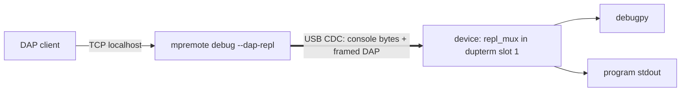

### Summary

A board with no network can't use `mpremote debug` at all, because the DAP client has nothing to connect to. The board does have one channel mpremote already holds though, the one carrying the REPL, and `mount` already interleaves its filesystem RPC over it. `--dap-repl` does the same for DAP: mpremote frames the DAP messages into that stream and exposes them on a local TCP port for the editor.

The framing shares the fs-hook's marker namespace so the two could be unified later: 0x18 keeps its meaning, codes 1..13 stay the fs-hook's, and a DAP frame is code 14 with an explicit two-byte length. The length is carried so the demux never has to interpret a payload; a program that prints 0x18 has it escaped (0x18 0x18) and everything unmarked is console output.

Writes are credit-limited, one unacknowledged frame at a time. The device's CDC receive ring drops the tail of a packet it has no room for rather than applying back-pressure, and a target sitting in `time.sleep()` isn't draining it, so a large `setBreakpoints` would otherwise get truncated.

This only works on ports where the REPL is a Python-visible stream in a `dupterm` slot, which in practice is stm32 on the legacy USB stack. Elsewhere the device refuses rather than handing back a stream that carries nothing. While a session is running Ctrl-C arrives as data rather than as an interrupt, so the session ends on the host letting go of the port (DTR, via `isconnected()`) and every exit path puts the dupterm slot back.

`--source` is refused with `--dap-repl`: mount and this channel both frame the same wire.

The console reader moves its stdout writes onto a separate bounded writer so a stalled stdout can't back-pressure the port that is also carrying DAP frames.

### Testing

`test_debug_units.sh` is device-free and covers the `MPDBG-READY` parser and the REPL-stream demux, including byte-at-a-time feeding. On a PYBD_SF6 over USB the five REPL-stream scenarios of my hardware suite pass: the session takes the stream it was launched over, reaches a breakpoint, program output containing the marker byte arrives intact, a large DAP response gets through, and the REPL comes back after the session. Not testable on the unix port, which has no `dupterm`.

### Trade-offs and Alternatives

A second USB CDC interface dedicated to DAP avoids the multiplexing, and I had that working, but only with custom firmware (upstream sets `MICROPY_HW_USB_CDC_NUM (2)` on one board) plus a `boot.py` change. A board worth a custom build is better served by `network.USBD_NCM` and the normal network path, whereas the REPL stream is there on the board as it ships. Throughput barely differs: on a PYBD_SF6 I measured about 81.5 kB/s over the shared stream against 81.7-108.8 kB/s over a dedicated CDC.

### Generative AI

I used generative AI tools when creating this PR, but a human has checked the code and is responsible for the description above.
