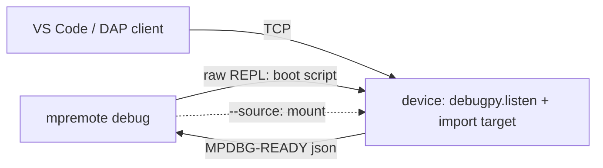

### Summary

There's no way today to put a breakpoint in code running on a MicroPython board and step through it from an editor. The pieces exist in separate places - `sys.settrace` in the firmware, a DAP server (`debugpy`) that runs on the device - but getting a session going means copying the server over, writing a boot script, finding the board's IP and hand-writing a `launch.json`. `mpremote debug` does that in one command.

```
mpremote connect /dev/ttyACM0 debug app:main
```

connects, runs a small boot script over the raw REPL that imports `debugpy`, starts listening and imports/calls the target, then prints one `MPDBG-READY {json}` line with the address the device actually bound. That line is the contract for editors and scripts: host, port, the firmware's runtime capabilities and, when a source directory is mounted, the `pathMappings` to use.



On top of that:

- `--source DIR` mounts the host directory before the target is imported, so the debugger stops in the file you are editing rather than a copy on the board. With `--loop`, a DAP restart evicts what the target imported and re-imports it, so an edit takes effect with no upload and no reset.
- `-t unix` runs the same boot script under a local unix-port binary (POSIX hosts), which is handy for testing without hardware.
- `--dap-log` interposes a logging proxy and writes each DAP message as JSONL.
- A named target can be picked from an `mpdebug.toml` found up the directory tree.

While the command is attached it drains the board's console and prints it. Without that a stm32 USB CDC console fills and `print` stalls the program being debugged, which looks like the DAP link has dropped.

### Testing

I've been driving this from an out-of-tree harness: a fake DAP client runs full sessions against the unix port, plus a hardware run on a PYBD_SF6 over WiFi (17 scenarios, including a `--source --loop` edit/restart cycle and killing mpremote at a breakpoint). That hardware run was of all three stacked PRs together. `test_mount.sh` passes at every commit on this branch on the same board. Not tested on esp32 or rp2 hardware in this form, or with a Windows host.

There's no in-tree test of a full session in this PR; mpremote's own test runner has no DAP client. The next PR in the stack adds device-free tests for the handshake parser.

### Trade-offs and Alternatives

The boot script is sent over the raw REPL on each run, stripped of comments and docstrings first (it's about 18 kB with them, and compiled on the board every time). Freezing it in firmware would avoid that but would tie mpremote to firmware that has it.

The device reports its own address rather than mpremote guessing one, because only the device knows which interface it bound. A board that reports a wildcard with no known address is an error rather than an endpoint nothing could connect to.

### Generative AI

I used generative AI tools when creating this PR, but a human has checked the code and is responsible for the description above.
